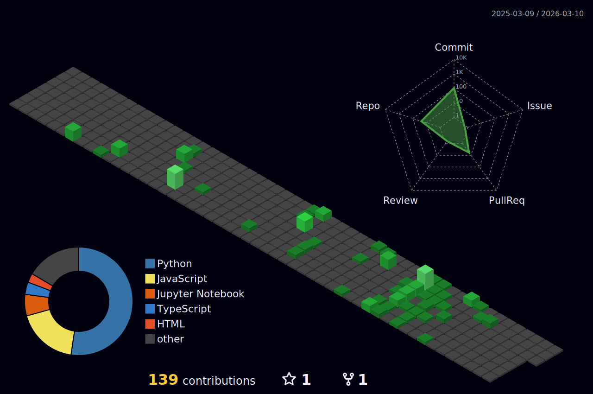

<h1 align="center">Hi 👋, I'm Shivang Sharma</h1>
<h3 align="center">AI/ML Engineer | Backend Developer | Data Scientist</h3>

<h3 align="left">GitHub Trophies:</h3>

---

I'm an AI/ML developer from India, selected as <b>1 of 19 students worldwide</b> for AI/ML Research at Iowa State University.
 
I thrive on building complex systems, from RAG architectures with LangChain to full-scale CI/CD pipelines on AWS.

🔭 I’m currently working on projects involving AWS, Docker, and GenAI.

🌱 I’m currently learning more about MLOps and distributed systems.

🚀 Check out my self-hosted CI/CD pipeline: <a href="https://github.com/ShivangSharma26/CloudPulse---AWS-Deployment-Service">CloudPulse Project</a>

👯 I’m looking to collaborate on open-source AI/ML projects.

📫 How to reach me: iamluckysharma99@gmail.com

⚡ Fun fact: My code worked on the first try once... in a dream.

<!-- 5. CONNECT WITH ME (Portfolio link moved to heading) -->
<h3 align="left">Connect with me:
  
</h3>

  <a href="https://linkedin.com/in/your-linkedin-username" target="blank"> <!-- <-- UPDATE THIS LINK -->
    
  </a>
  
  <a href="https://instagram.com/your-insta-username" target="blank"> <!-- <-- UPDATE THIS LINK -->
    
  </a>
  

<h2 align="left">My Tech Stack 💻</h2>

    
  
  
   
    
  
  
   
    
  
  

<h3 align="left">🚀 Featured Projects:</h3>

<h3 align="left">🏆 Achievements:</h3>
<ul>
<li>
🥇 <b>Selected for AI/ML Research @ Iowa State University, USA</b> (1 of 19 Students Selected Worldwide)
</li>
<li>
🏆 <b>Selected for SRIP 2025 @ IIT Gandhinagar</b> (Top 0.25% of 80,000+ applicants)
</li>
<li>
📈 Solved <b>1000+ problems</b> across LeetCode & GFG
</li>
<li>
💻 <b>1200+ Rating</b> @ Codeforces
</li>
</ul>

## 🧊 Contributions

  

---

🖤 Built with passion by <b>Shivang Sharma</b>

